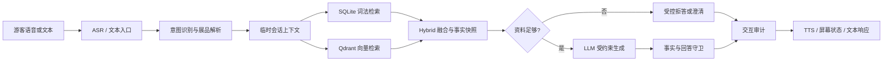

<div align="center">

# 金潮杯博物馆

### 面向真实展品的可信对话式语音讲解系统

以展品为入口，以审核事实为依据，以自然对话为体验。

<p>
  
  
  
  
</p>

<p>
  <a href="docs/roadmap/stage4-production-release-report.md">生产验收报告</a>
  · <a href="docs/README.md">文档中心</a>
  · <a href="docs/architecture/exhibit-rag-design.md">RAG 设计</a>
</p>

</div>

## 这是什么

金潮杯博物馆是一个面向博物馆研学和现场参观场景的**展品级可信对话系统**。

游客不需要浏览复杂菜单，只要直接说出展品并提问：

```text
“南宋官窑青瓷樽式炉是什么年代的？”
“它是用什么材料做的？”
“这件展品现在值多少钱？”
```

系统会识别展品、检索已发布的馆方事实，并用适合现场聆听的方式回答。资料不足时明确拒答，不让模型用常识补造馆藏信息。

> 当前定位是一个完成度明确的 **100 件馆藏 Demo**，重点是把用户体验、事实边界和整条服务链路做好，而不是盲目扩大展品数量。

## 已经做到什么

| 能力 | 当前状态 |
| --- | --- |
| 生产展品 | 100 件已发布展品 |
| 知识依据 | 171 条已发布事实、104 个来源 |
| 检索方式 | SQLite 词法检索 + Qdrant 向量检索的 Hybrid RAG |
| 向量模型 | 阿里云 DashScope `text-embedding-v4`，1024 维 |
| 回答模型 | 生产文本验收使用 `qwen3.7-flash` |
| 内容治理 | draft → review → publish 生命周期 |
| 事实安全 | 事实 ID、来源 ID、回答守卫和交互审计 |
| 对话体验 | 展品上下文继承、多轮追问、价格问题受控拒答 |
| 设备链路 | `/museum/v1/` WebSocket、`/museum/ota/` OTA |
| 生产状态 | 服务端与 Qdrant healthy，容器重启次数为 0 |

## 核心体验

### 说出展品，就能开始对话

系统从用户当前问题中解析展品名称或已审核别名，建立临时会话上下文。第一轮确定展品后，游客可以继续问“它是什么年代”“它有什么用途”，不必反复重复全名。

### 回答有依据，也知道什么时候不能答

每个可回答事实都绑定来源和发布版本。价格、未经馆方确认的传说、资料中不存在的细节，会进入受控拒答，而不是让大模型自由发挥。

### 相似展品不静默串线

暖耳、钱袋、南宋官窑熏炉和良渚玉器等相似对象经过独立检索和多轮文本验收。出现歧义时，系统优先澄清，不擅自选择一个展品。

## 系统链路



## 为什么不是普通聊天机器人

普通聊天机器人追求“尽量回答”；博物馆讲解系统首先追求“回答不能错绑、不能越界”。本项目把回答拆成可审计的事实单位：

```text
展品实体
  -> 已发布 revision
  -> exhibit_fact
  -> source_document
  -> 向量索引 payload
  -> 回答守卫
  -> interaction_trace
```

因此每一轮回答都可以回查：

- 用户问了什么；
- 系统识别了哪件展品；
- 使用了哪些事实和来源；
- 是否调用了 LLM；
- 最终回答是否通过守卫；
- 为什么拒答、澄清或回退。

## 生产验收摘要

阶段 4 已完成百件馆藏生产发布和即时文本验收：

- Readiness：`ready=true`；
- Qdrant：171/171 点，缺失、重复、payload 不一致均为 `0`；
- 固定 Canary：4/4 通过；
- 分层文本验收：30/30 通过；
- Grounded 问题：20/20 通过；
- 价格拒答：10/10 通过；
- 连续会话：10/10 组通过；
- 相似展品干扰：暖耳、钱袋、熏炉 3/3 组通过；
- 最近生产日志：未发现异常或旧课程/待办/学生业务标记。

详细证据见 [阶段 4生产发布报告](docs/roadmap/stage4-production-release-report.md)。

本报告只证明服务端文本聊天和生产 RAG 链路，不等同于麦克风、ASR、扬声器、屏幕或真机 TTS 验收通过。

## 快速开始

### 1. 准备环境

```powershell
cd main/xiaozhi-server
pip install -r requirements.txt
```

准备本地配置：

```powershell
Copy-Item config.example.yaml config.yaml
```

在 `config.yaml` 中配置本地 LLM，并确认 `business_runtime.type: museum`。生产环境的 DashScope 密钥只放在服务器 `.env`，不要写入仓库。

### 2. 启动服务

```powershell
cd ../..
$env:MUSEUM_DATA_DIR = "$PWD\main\xiaozhi-server\data"
$env:MUSEUM_IMAGE_TAG = "local"
docker compose `
  -f main/xiaozhi-server/docker-compose.yml `
  up -d --build
```

需要调用 DashScope 时，在当前终端设置 `DASHSCOPE_API_KEY`，不要把密钥写进 README、配置样例或 Git 历史。

### 3. 直接进行文本对话

```powershell
cd main/xiaozhi-server
python scripts/museum_text_chat.py --require-llm
```

也可以执行单轮 JSON 验证：

```powershell
python scripts/museum_text_chat.py `
  --require-llm `
  --once "红绸彩绣花蝶钱袋是什么展品？" `
  --json
```

### 4. 检查 RAG 发布状态

```powershell
python scripts/check_museum_readiness.py
python scripts/run_museum_canary.py --require-llm --run-id local-canary
```

## 仓库结构

```text
.
├─ main/xiaozhi-server/       服务端、博物馆运行时、内容包和验收脚本
├─ main/museum-web-test/      浏览器语音链路调试工具
├─ docs/                      产品、架构、协议、路线和生产报告
├─ Dockerfile-server          服务端生产镜像
└─ AGENTS.md                  项目协作与部署边界
```

关键模块：

| 模块 | 职责 |
| --- | --- |
| `core/museum/runtime.py` | 博物馆对话运行时和会话上下文 |
| `core/museum/exhibit_resolver.py` | 展品名称、别名和歧义解析 |
| `core/museum/retrieval.py` | 词法、向量和 Hybrid 检索 |
| `core/museum/answering.py` | 依据约束、拒答和回答守卫 |
| `core/museum/store.py` | SQLite 内容、来源、审计和发布状态 |
| `core/museum/qdrant_index.py` | Qdrant collection 与 alias 管理 |
| `scripts/museum_text_chat.py` | 文本聊天验收入口 |

## 文档入口

- [文档中心](docs/README.md)
- [RAG 系统详细设计](docs/architecture/exhibit-rag-design.md)
- [阶段 4生产发布报告](docs/roadmap/stage4-production-release-report.md)
- [服务端部署方案](docs/production-deployment-plan.md)
- [服务端与固件协议](docs/protocol/server-firmware-contract.md)
- [内容合同](docs/requirements/museum-content-contract.md)

## License

本项目采用 [MIT License](LICENSE)。
