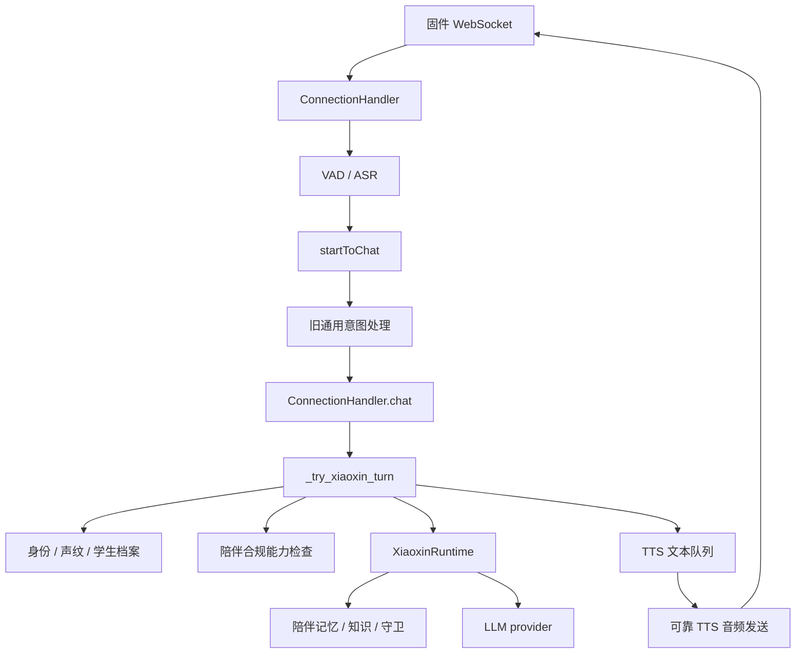

# 当前服务端与固件运行链路审计

## 状态

- 审计日期：2026 年 8 月 9 日
- 服务端仓库：`D:\AI_Pet\jinchao-cup-museum`
- 服务端提交：`d71f7b50a3c68fa0a123f7a403143bc59b189fe8`
- 固件仓库：`D:\AI_Pet\museum-firmwire`
- 固件提交：`2802b325058cccf851c7226e996d8d93d850f74e`
- 目标板：`CONFIG_BOARD_TYPE_WAVESHARE_ESP32_S3_TOUCH_LCD_1_46=y`

本文只描述审计时实际存在的代码。产品范围以 [`../product/PRD.md`](../product/PRD.md) 为准，目标架构以 [`business-rebuild.md`](business-rebuild.md) 为准。

## 1. 审计结论

当前仓库不能通过更换提示词直接变成博物馆产品。设备连接、ASR、LLM、TTS、可靠播放、OTA 与旧学生陪伴业务已经交织在同一个连接对象中。

可以保留的底层能力：

- WebSocket 设备连接与稳定 `device_id`；
- VAD 与 ASR 音频接收；
- LLM 提供商适配；
- TTS 文本队列和音频发送；
- `ready`、`done` ACK 与预缓冲可靠播放；
- OTA、设备固件版本和电量遥测；
- 目标板触摸、LVGL 页面和动画能力。

必须从比赛运行路径移出的业务：

- 用户绑定和说话人身份解析；
- 声纹和学生档案；
- 合规中心对陪伴聊天的账号门槛；
- 长期陪伴记忆和关系成长；
- 课程、待办、天气 Overview；
- 主动提醒、门铃投递和小程序控制流程；
- 通用工具或自由聊天作为博物馆问答的自动回退。

总体判断：保留传输和媒体基座，在 `ConnectionHandler` 与具体业务之间建立高层 `ConversationRuntime`，由新的 `MuseumRuntime` 接管比赛链路。置信度：高。

## 2. 当前服务端真实链路



### 2.1 进程启动

[`../../main/xiaozhi-server/app.py`](../../main/xiaozhi-server/app.py) 无条件创建并启动 `XiaoxinControlRuntime`，再把同一个实例传给 WebSocket 和 HTTP 服务。旧身份库、提醒调度、设备注册、Overview、MQTT 门铃和陪伴后台目前共享一个总运行时。

### 2.2 连接与会话

[`../../main/xiaozhi-server/core/connection.py`](../../main/xiaozhi-server/core/connection.py) 每次 WebSocket 连接创建一个新的 `session_id`，固件通过请求头发送 MAC 地址作为稳定 `device_id`。

这里必须区分：

- `ConnectionHandler.session_id` 是传输连接会话，断线重连后变化；
- PRD 中的游客会话是一次参观会话，不能直接等同于 WebSocket 会话。

新的 `visitor_session_id` 必须由博物馆业务层管理。短暂断线只能按明确规则恢复，结束参观后不可恢复。

### 2.3 语音入口

音频经过 ASR 后由 [`../../main/xiaozhi-server/core/handle/receiveAudioHandle.py`](../../main/xiaozhi-server/core/handle/receiveAudioHandle.py) 的 `startToChat()` 处理。当前顺序是：

1. 解析声纹增强文本；
2. 检查设备绑定和每日输出上限；
3. 运行旧通用意图处理；
4. 发送 STT 与 TTS start；
5. 在线程池调用 `ConnectionHandler.chat()`。

博物馆运行时不能放在旧通用意图之后作为普通回退，否则路线指令、结束会话和展品选择可能被旧工具抢先处理。比赛模式只保留中断、音量等设备级命令，其余文本先交给博物馆运行时。

### 2.4 旧业务耦合点

`ConnectionHandler._try_xiaoxin_turn()` 当前直接完成：

- 从控制运行时获取身份解析器；
- 根据声纹查找用户、宠物和学生档案；
- 检查陪伴聊天与记忆权限；
- 调用 `XiaoxinRuntime.handle_turn()`；
- 把回复直接写入 TTS 队列和对话历史。

这是需要替换的主要边界。新的连接层不能认识 `student_profile`、`CompanionMind`、`Capability.COMPANION_CHAT` 或个人记忆主体。

### 2.5 LLM 与 TTS

现有 `LLMChatAdapter` 能把不同 LLM provider 统一成同步完整回答，适合第一版 `MuseumRuntime` 复用。P0 不应先重写新的流式 LLM 框架。

现有 TTS 链路已经具备句子 ID、文本队列、`ready` ACK、预缓冲、`done` ACK，以及完成、超时和错误区分。博物馆业务只输出可播报文本和设备状态，不复制 TTS 实现。

### 2.6 HTTP 管理入口

[`../../main/xiaozhi-server/core/http_server.py`](../../main/xiaozhi-server/core/http_server.py) 当前挂载 OTA、视觉接口和旧小芯控制台。新的馆方接口应单独使用 `/api/museum/*`，不能继续向旧 `XiaoxinControlHandler` 增加博物馆字段。

## 3. 当前固件真实链路

### 3.1 连接合同

目标板通过 `/xiaoxin/v1/` 建立 WebSocket。Hello 已发送设备 MAC、设备 UUID、麦克风参数、设备时间、固件状态，以及 `tts_ready_ack`、`tts_done_ack` 和 `tts_preroll_buffer`。博物馆协议可以复用该连接，不需要第二条 WebSocket。

### 3.2 入站与出站 JSON

`D:\AI_Pet\museum-firmwire\main\application.cc` 已集中分发 `tts`、`stt`、`llm`、`notification`、`xiaoxin_event` 和 `xiaoxin_overview_update`。增加 `museum_state` 与 `museum_action_result` 不需要修改底层 WebSocket 解析器。

`Protocol::SendText()` 当前是受保护方法，固件没有博物馆操作发送接口。应新增结构化 `SendMuseumAction()`，由 `Application` 生成请求 ID、发送动作并管理待提交状态。目标板显示类不能自行拼 JSON，也不能提前宣布路线推进成功。

### 3.3 当前目标板 UI

目标板当前三页是：

1. 宠物主页；
2. 通知页；
3. 天气、课程、待办和陪伴成长 Overview。

页面切换、触摸按下、拖动、释放、弹性动画和系统设置已经存在。比赛固件保留触摸驱动和动画基座，把页面业务替换为：

1. 展品页：角色、当前展品、模式和知识状态；
2. 路线页：路线站点、观察任务和前后站操作；
3. 回顾页：已完成站点、探索主题和结束会话操作。

低电量、Wi-Fi、OTA 等系统通知继续作为覆盖层保留，不再作为课程或待办业务页面。

## 4. 保留与替换矩阵

| 模块 | 决策 | 原因 |
| --- | --- | --- |
| WebSocket 与设备认证 | 保留 | 已有稳定设备标识和音频通道 |
| VAD、ASR、LLM、TTS provider | 保留 | 与博物馆领域无关 |
| TTS 可靠 ACK | 保留 | 已完成真机可靠播放 |
| OTA 与固件遥测 | 保留 | 比赛部署仍然需要 |
| 设备连接注册表 | 保留并收窄 | 只负责在线连接和发送 |
| `ConnectionHandler.chat()` 通用工具链 | 比赛模式旁路 | 可能产生资料外回答 |
| `XiaoxinRuntime` | 从比赛路径断开 | 业务实体和规则不匹配 |
| `XiaoxinControlRuntime` | 暂时保留底层部分 | OTA、注册表仍被依赖，后续拆分 |
| 身份、声纹、学生档案 | 禁用后删除 | PRD 明确排除 |
| 课程、待办、主动提醒 | 禁用后删除 | PRD 明确排除 |
| 固件触摸与动画基座 | 保留 | 可承接新页面 |
| 固件 Overview 数据模型 | 替换 | 字段全部属于旧业务 |

## 5. 必须防止的迁移风险

1. 传输会话冒充游客会话，导致断线后错误创建或恢复参观。
2. 旧意图抢答博物馆指令。
3. `MuseumRuntime` 未处理后落入通用 LLM，自由生成资料外事实。
4. 固件接受半份状态，新展品与旧路线同时存在。
5. 触摸下一站后 UI 提前切换，提交失败无法回滚。
6. 弱网重试导致路线重复推进。
7. 比赛部署仍暴露学生身份、声纹和长期记忆入口。
8. 对话已切换但旧调度器仍主动投递课程或待办。

## 6. 推荐切入点

第一刀不是删除 `core/xiaoxin`，而是增加统一入口：

```python
class ConversationRuntime(Protocol):
    def handle_turn(self, request: TurnRequest) -> TurnOutcome: ...
```

`ConnectionHandler` 只负责接收 ASR 文本、构造请求、调用业务运行时、原子发送设备状态、把 `spoken_text` 交给现有 TTS，并记录传输失败。

比赛配置选用 `MuseumRuntime`。旧运行时只作为迁移期间的可回退适配器保留，真机验收通过后再从启动路径和代码库删除。
