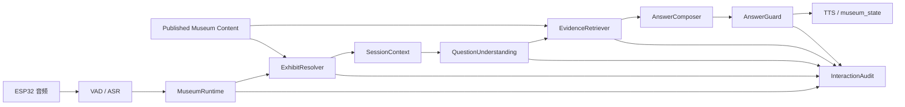

# 展品级可信语音 RAG 系统详细设计

## 文档状态

- 状态：`proposed`
- 编制日期：2026 年 8 月 11 日
- 适用范围：金潮杯博物馆项目比赛版及其后续内容扩展
- 目标设备：微雪 `ESP32-S3-Touch-LCD-1.46`
- 设计对象：服务端博物馆业务运行时、内容数据、检索链路、回答约束和设备状态反馈

本文基于已经确认的硬件和现场约束重新定义下一阶段系统：设备不能通过固定点位、视觉识别、定位信号或触摸选择可靠地知道游客正在观看哪件展品；游客仍按馆内既有标识和个人兴趣自然参观；系统只在游客主动说出展品并提问时提供可信、简短、适合语音播放的讲解。

本文中的“目标”不得写成现状。当前代码已经具备展品事实、资料来源、内容版本、临时会话、事实检索、回答守卫和交互审计，但仍以设备点位或外部传入展品 ID 作为主要上下文入口，尚未实现本文定义的“从用户问题解析展品”主链路。

## 1. 结论

产品不定位为替游客安排参观顺序的路线导览系统，也不要求设备自动感知展品。产品定位为：

> 面向儿童、亲子家庭和普通游客的展品级可信语音讲解伙伴。游客在问题中说出展品，系统从馆方审核内容中检索依据，以自然、简短的方式回答，并在临时会话中支持围绕同一展品继续追问。

技术定位为：

> 以展品实体解析为入口、以已发布展品事实为最小依据单位、以语音短回答为输出形态的领域 RAG 系统。

核心链路是：

```text
用户语音
  -> ASR 文本
  -> 社交意图与展品指称判断
  -> 展品实体解析
  -> 临时会话上下文建立或继承
  -> 限定展品与发布版本
  -> 事实级检索与依据快照
  -> 依据充分性判断
  -> 受事实约束的儿童友好表达
  -> TTS 与设备状态
  -> 交互审计和未命中回收
```

系统的主要价值不是“知道得多”，而是同时满足以下条件：

1. 用户不需要操作复杂界面，只需直接说出展品并提问。
2. 系统不会把问题错误绑定到默认展品。
3. 回答只使用当前发布版本中的审核事实。
4. 资料不足时明确停止，不使用模型常识补全。
5. 第一轮确定展品后，后续追问不需要重复说展品名。
6. 用户提到新展品时，系统能够自然切换上下文。
7. 回答适合现场语音播放，而不是朗读长文档。

## 2. 已确认约束

### 2.1 硬件约束

- 设备不能可靠定位到具体展品。
- 设备不能依赖摄像头识别展品。
- 设备不承担复杂展品列表、路线地图或知识库浏览。
- 触摸屏主要用于显示状态和少量基础操作，不作为建立展品上下文的必要入口。
- 设备的稳定职责是唤醒、录音、音频传输、语音播放和有限状态显示。

### 2.2 现场约束

- 馆内已经存在导览标识、空间顺序和展签。
- 游客可以跳过展品、折返或按兴趣自由参观。
- 系统不得把观察建议包装成必须完成的任务。
- 系统不得强迫游客按服务端路线推进。
- 多组陌生游客可能连续使用同一设备，不能依赖长期身份和个人画像。

### 2.3 内容约束

- 具体事实必须来自馆方认可、出版物、研究材料或其他可追溯来源。
- 模型常识不是馆方事实来源。
- 向量命中、关键词命中和模型判断都不是最终依据；最终依据是已发布且绑定来源的展品事实。
- 统一回答策略只能改变表达方式，不能改变事实集合；游客的临时表达要求不形成持久化模式。

## 3. 目标与非目标

### 3.1 P0 目标

1. 从用户问题中识别明确出现的展品名称或别名。
2. 第一轮问题成功建立临时会话的当前展品。
3. 后续代词、省略主语和短追问能够继承当前展品。
4. 用户明确提到另一件展品时切换当前展品。
5. 展品不明确时请求澄清，不猜测。
6. 只从当前展品的发布事实中建立依据快照。
7. 资料不足时返回稳定、可理解的知识兜底。
8. 输出 2 至 4 句、适合儿童理解和 TTS 播放的回答。
9. 保存展品解析、事实依据、回答结果和阶段延迟。
10. 在真机上验证麦克风、ASR、检索、TTS、扬声器和屏幕状态完整链路。

### 3.2 P1 目标

- 馆方内容导入、审核、发布、撤回和回滚工具。
- 展品别名维护和歧义检查。
- 未命中问题聚合和内容缺口回收。
- 稳定的儿童友好短讲解策略；必要时支持游客通过自然语言临时要求更简单或更详细。
- 跨展品比较，但必须明确识别两个展品并分别建立依据快照。
- 基于真实评测结果决定是否增加向量检索。

### 3.3 非目标

- 自动判断游客在馆内的位置。
- 自动识别游客正在看的展品。
- 强制参观路线、下一站或任务完成率。
- 通过声纹、账户或长期记忆识别游客。
- 通用百科问答。
- 无依据的开放式聊天。
- 让模型自由选择展品 ID。
- 用向量数据库替代内容审核和来源绑定。
- 在设备上实现完整内容管理或复杂导航界面。

## 4. 领域语言

### 展品指称

用户语句中直接指向某件展品的名称、别名、简称或馆方维护的口语称呼。例如“战国水晶杯”“水晶杯”和经过审核的其他别名。

展品指称必须来自可维护的展品词表。模型可以辅助判断一句话是否在使用某个候选指称，但不能生成数据库中不存在的展品标识。

### 展品解析

将用户问题映射到零个、一个或多个候选展品的确定性业务过程。结果包括匹配状态、候选展品、匹配词、置信原因和是否允许建立当前展品。

### 当前会话展品

临时游客会话中最近一次通过明确展品指称成功确认的展品。它用于支持“它为什么透明”“怎么做出来的”等后续追问，不代表设备物理位置。

### 显式展品切换

用户在新问题中明确提到另一件可识别展品，因此系统将当前会话展品更新为新展品。切换由用户语言触发，不由路线、设备点位或模型建议触发。

### 展品事实

关于一件展品的最小可审核陈述。每条事实属于一个内容版本，并绑定至少一个资料来源。

### 依据快照

本轮回答实际使用的展品事实、资料来源和内容版本集合。回答完成后仍可通过审计记录复核。

### 知识兜底

当前发布内容不足以回答问题时的正常业务结果。它不是系统错误，也不得触发通用模型补全。

### 澄清问题

展品缺失或存在多个合理候选时，系统用于获取必要上下文的短问题。澄清问题只解决“在问哪件展品”，不把用户带入强制流程。

## 5. 业务流程

### 5.1 首轮明确提到展品

示例：

> 战国水晶杯为什么这么透明？

处理过程：

1. ASR 返回文本。
2. 系统排除纯问候、感谢和告别等社交意图。
3. 展品解析器匹配“战国水晶杯”。
4. 系统确认唯一活动展品并建立当前会话展品。
5. 检索该展品当前发布版本中的相关事实。
6. 建立依据快照。
7. 回答策略生成短回答。
8. 回答守卫确认回答中的具体事实均被依据覆盖。
9. 系统下发 `grounded` 状态并进入 TTS。
10. 记录解析结果、依据和回答。

### 5.2 围绕同一展品追问

首轮：

> 战国水晶杯是什么时候的？

追问：

> 它是怎么做出来的？

第二轮没有新展品指称，系统继承当前会话展品“战国水晶杯”。继承只影响展品范围，不直接决定答案；系统仍需重新检索与“制作工艺”相关的事实。

### 5.3 用户主动切换展品

当前会话展品为“战国水晶杯”，用户随后问：

> 那越王勾践剑是用什么材料做的？

如果“越王勾践剑”是唯一可识别展品，系统切换当前会话展品，并且本轮不得混入水晶杯事实。

### 5.4 没有展品指称且没有会话上下文

用户第一句话是：

> 它为什么长这样？

系统不得猜测默认展品，应回答：

> 你想问哪件展品？可以直接告诉我展品名称，再问你想知道的内容。

此结果记为 `missing_context`，原因是 `exhibit_reference_missing`。

### 5.5 多个展品候选

假设馆内同时维护“水晶杯”和“玻璃杯”两个展品或存在重叠别名，用户只说：

> 那个杯子是什么时候的？

系统返回简短澄清问题，不自动选择得分最高的候选。解析状态为 `ambiguous`，审计中保存候选展品 ID，但不更新当前会话展品。

### 5.6 展品明确但资料不足

用户问：

> 战国水晶杯的主人叫什么名字？

展品解析成功，但发布事实不支持答案。系统返回：

> 关于战国水晶杯，当前馆方资料还没有确认它具体属于谁，我不能替它补一个名字。

此结果为 `unsupported`，不是 `missing_context`。

### 5.7 普通问候

用户说“你好”“你是谁”时，不要求先识别展品。系统可以返回固定范围内的身份和能力说明，但不得借机引入具体展品事实。

## 6. 状态模型

### 6.1 展品解析状态

| 状态 | 含义 | 是否更新当前会话展品 |
| --- | --- | --- |
| `explicit` | 问题中唯一匹配到活动展品 | 是 |
| `inherited` | 问题无新展品指称，继承已有会话展品 | 否 |
| `ambiguous` | 存在多个合理候选 | 否 |
| `missing` | 没有指称，也没有已有上下文 | 否 |
| `not_found` | 用户疑似说出展品，但词表中没有可用展品 | 否 |

### 6.2 回答知识状态

| 状态 | 含义 |
| --- | --- |
| `conversational` | 有限社交回复，不涉及展品事实 |
| `retrieving` | 已确定查询范围，正在检索或生成 |
| `grounded` | 回答由依据快照支持 |
| `unsupported` | 展品明确，但发布事实不足 |
| `missing_context` | 无法确定展品 |
| `temporary_failure` | 网络、模型、数据库或音频链路暂时失败 |

知识状态必须区分“没有资料”和“系统故障”。设备不得把 `unsupported` 显示成错误红屏。

### 6.3 会话规则

1. 尚未确认展品时只保留请求级 `missing_context`，不创建可继承的 `visitor_session`。
2. 首次 `explicit` 解析成功后创建会话，并绑定非空 `current_exhibit_id`。
3. 只有 `explicit` 解析结果可以首次建立或切换当前展品。
4. `inherited` 只能沿用仍然活动且有发布版本的当前展品。
5. `ambiguous`、`missing` 和 `not_found` 不改变当前展品。
6. 会话过期后，旧展品上下文不得继续使用。
7. 新的明确展品指称立即覆盖旧展品上下文。
8. 不保存长期游客画像。

## 7. 总体架构



`MuseumRuntime` 是连接层调用的外部 seam。连接层只需要提交一轮语音文本和会话信息，不需要理解别名、检索、版本、澄清、证据或回答守卫。

建议保持一个小接口：

```python
class ConversationRuntime(Protocol):
    def handle_turn(self, request: TurnRequest) -> TurnOutcome: ...
```

复杂度应集中在 `MuseumRuntime` 内部的深模块中，而不是扩散到 WebSocket 处理器、ASR 回调和 TTS 队列。

## 8. 模块设计

### 8.1 ExhibitResolver

职责：根据用户文本和已有会话上下文，返回确定的展品解析结果。

建议接口：

```python
@dataclass(frozen=True)
class ExhibitResolution:
    status: str
    exhibit_id: str | None
    exhibit_name: str | None
    matched_text: str | None
    candidate_ids: tuple[str, ...]
    context_source: str

class ExhibitResolver:
    def resolve(
        self,
        *,
        question: str,
        current_exhibit_id: str | None,
    ) -> ExhibitResolution: ...
```

接口必须隐藏文本标准化、别名索引、候选评分和歧义阈值。调用者只能依赖解析状态和最终候选。

解析器不得调用开放式 LLM 直接返回任意展品 ID。允许的实现顺序是：

1. 规范名称精确包含匹配；
2. 别名精确包含匹配；
3. 规范化后的 FTS 或词项匹配；
4. 对候选执行确定性消歧；
5. 没有新指称时才考虑会话继承；
6. 无法唯一确定时返回澄清状态。

如果以后使用 LLM 辅助消歧，模型只能从服务端给出的候选 ID 中选择，并且低置信或结果非法时必须返回 `ambiguous`。

### 8.2 SessionContext

职责：创建、恢复、过期和更新临时游客会话。

它不保存物理位置，只保存最近一次明确确认的展品。建议将“设备连接会话”和“游客对话会话”继续分离：WebSocket 重连可以恢复短期游客会话，但超时后必须清空展品上下文。

主要操作：

```python
open_or_create(device_id, requested_session_id, occurred_at)
set_current_exhibit(session_id, exhibit_id, occurred_at)
get_current_exhibit(session_id, occurred_at)
end_session(session_id, occurred_at)
```

### 8.3 QuestionUnderstanding

职责：在展品已经确定后，将游客自然表达转换为受约束、可审计的查询意图。它不负责识别展品，也不直接生成答案。

第一版采用两级分类：

| 粗分类 | 细分类示例 | 行为 |
| --- | --- | --- |
| `social` | `social` | 进入有限社交回复，不检索展品事实 |
| `exhibit_knowledge` | `overview`、`era`、`material`、`craft`、`appearance`、`excavation`、`dimensions`、`price` | 将细分类映射到允许检索的事实类型 |
| `comparison` | `comparison` | 当前版本不自动拼接单展品事实，资料和上下文不足时返回不支持 |
| `unclear` | `unknown` | 不猜测具体事实类型 |

建议接口：

```python
@dataclass(frozen=True)
class QuestionUnderstanding:
    coarse_intent: str
    fine_intent: str
    fact_types: tuple[str, ...]
    query_terms: tuple[str, ...]
    confidence: float
    source: str

def understand_question(question: str) -> QuestionUnderstanding: ...
```

实现规则：

1. 先识别纯社交和比较请求，再识别展品知识细分类；
2. 细分类名称不得直接假定等于数据库 `fact_type`，必须通过显式映射转换；
3. 明确的价格等问题优先于句子中偶然出现的年代词；
4. 礼貌词和问候不得遮蔽后面的展品问题；
5. 低置信结果可以在以后交给受限 LLM 分类，但模型只能返回允许的枚举值；
6. 意图结果只能约束检索范围，不能让没有依据的事实变得可回答；
7. 粗分类、细分类和置信度必须写入交互审计。

### 8.4 EvidenceRetriever

职责：在已经确定的展品和发布版本内检索少量可支撑回答的事实。

建议接口：

```python
class EvidenceRetriever:
    def retrieve(
        self,
        *,
        exhibit_id: str,
        question: str,
        limit: int = 4,
    ) -> EvidenceSnapshot | None: ...
```

检索器不得跨越到其他展品，也不得返回草稿、已撤回版本或无来源事实。

### 8.5 AnswerComposer

职责：把依据快照表达为适合语音播放的回答。

表达规则：

- 2 至 4 句；
- 优先直接回答问题；
- 使用儿童能够理解的词语；
- 必要时解释一个专业词；
- 最多提供一个可选观察提示；
- 不朗读来源 ID、版本号和数据库字段；
- 不把“你可以看看……”表达成必须完成的任务；
- 不加入依据之外的数字、年代、人物、地点和因果结论。

### 8.6 AnswerGuard

职责：在回答进入 TTS 前验证回答是否仍被依据覆盖。

最低检查：

- 回答使用的事实 ID 全部属于依据快照；
- 回答新增的数字全部存在于事实文本；
- 回答长度和句数符合语音约束；
- 没有跨展品事实；
- 模型输出为空、超长或不可验证时回退到确定性答案；
- 没有依据时只能返回知识兜底。

### 8.7 InteractionAudit

职责：记录本轮可复核事实。

建议新增记录内容：

- `exhibit_resolution_status`
- `exhibit_context_source`
- `matched_exhibit_text`
- `candidate_exhibit_ids`
- `resolved_exhibit_id`
- `content_revision_id`
- `fact_ids`
- `source_ids`
- `guard_result`
- `unanswered_reason`
- 展品解析、检索、生成、守卫和总耗时

## 9. 数据模型调整

### 9.1 exhibit_alias

当前 `exhibit.aliases_json` 可以支撑单展品演示，但不利于别名冲突检查、索引和运营维护。目标模型建议增加：

| 字段 | 含义 |
| --- | --- |
| `id` | 别名记录标识 |
| `exhibit_id` | 所属展品 |
| `alias_text` | 原始别名 |
| `normalized_text` | 用于匹配的规范化文本 |
| `alias_type` | `official`、`short`、`spoken`、`historic` |
| `priority` | 同一展品内的匹配优先级 |
| `status` | `active` 或 `archived` |

活动别名的规范化文本不得在多个活动展品之间静默冲突。发布工具发现冲突时必须拒绝发布或要求内容人员明确标记为需要澄清的共享称呼。

比赛版可以先从 `aliases_json` 构建内存索引，等内容规模扩大后再迁移到独立表。外部解析接口不应因存储方式变化。

### 9.2 visitor_session

比赛版采用懒创建，不做 `current_exhibit_id` 可空迁移：

- `visitor_session` 只在首次明确展品后创建；
- `current_exhibit_id` 保持非空外键；
- 首轮无展品请求使用 `request_id`、`device_id` 和 `interaction_trace` 记录；
- 会话创建不要求 `device_placement.default_exhibit_id`，也不得用设备点位静默绑定展品。

### 9.3 interaction_trace

需要增加展品解析审计字段，或将其作为结构化 JSON 保存。必须能够回答：

1. 用户原话是什么；
2. 系统识别了哪个展品；
3. 为什么识别为该展品；
4. 是否继承了旧上下文；
5. 是否存在其他候选；
6. 最终使用了哪些事实和来源；
7. 回答为什么被允许进入 TTS。

### 9.4 device_placement

`device_placement` 不再是比赛版建立展品上下文的前提。可以保留用于固定展台设备、后台资产管理或开发演示，但生产语音问答默认不得通过它静默指定展品。

## 10. 展品解析算法

### 10.1 文本规范化

规范化仅服务于匹配，不覆盖原始问题：

- 统一全角和半角字符；
- 去除不影响指称的空白和常见标点；
- 英文字母转小写；
- 保留汉字、数字和有辨识作用的型号；
- 应用馆方维护的等价词，不做开放式同义词扩展。

### 10.2 候选生成

候选来源按可靠性排序：

1. 规范名称完整匹配；
2. 唯一活动别名完整匹配；
3. 多词组合匹配；
4. FTS 命中；
5. 会话已有展品。

会话已有展品不是新指称候选。只有在问题中没有发现任何其他展品指称时才能继承。

### 10.3 唯一性规则

- 唯一完整规范名称匹配：`explicit`。
- 唯一无冲突别名匹配：`explicit`。
- 多个展品具有相同最高可靠性匹配：`ambiguous`。
- 新指称匹配到一个展品时，即使会话中已有另一个展品，也选择新展品。
- 只有弱匹配而没有足够区分信息时，不得自动绑定。
- 用户疑似说出未收录展品名称时返回 `not_found`，不能退回当前展品回答。

### 10.4 ASR 错误处理

展品名称容易被 ASR 识别错误，因此内容维护需要支持经过验证的语音别名。例如只有在真实录音中稳定出现的误识别形式，才允许作为 `spoken` 别名加入。

不得自动把任意相似词写入别名库。新增语音别名必须保留来源：测试录音、设备型号、ASR 提供方和确认时间。

## 11. 事实级 RAG 检索

### 11.1 检索范围

检索前必须已经得到唯一展品 ID。检索 SQL 或索引查询必须同时限定：

- 活动展品；
- 当前发布内容版本；
- 绑定至少一个来源的事实；
- 未撤回资料来源；
- 当前问题允许的事实类型。

### 11.2 第一阶段检索策略

在 20 至 30 件展品、每件数十条事实的比赛规模下，优先使用：

```text
展品过滤
  + FTS5
  + 事实类型词表
  + 关键词匹配
  + 介绍类问题的固定事实类型排序
```

这一方案可解释、延迟低、容易测试。当前不应为了“像 RAG”而强制引入独立向量数据库。

### 11.3 向量检索启用条件

只有评测显示以下问题持续存在时才增加向量检索：

- 用户使用大量非词表表达，FTS 召回明显不足；
- 同义表达无法通过可维护关键词解决；
- 内容规模扩大后人工词表成本过高。

即使增加向量检索，也必须先限定展品和发布版本。向量结果只负责候选召回，不能绕过事实状态、来源绑定和回答守卫。

### 11.4 依据快照

依据快照必须是不可变的本轮记录，至少包含：

```json
{
  "exhibit_id": "warring-states-crystal-cup",
  "content_revision_id": "warring-states-crystal-cup-r1",
  "content_version": 1,
  "fact_ids": ["fact-crystal-cup-material"],
  "source_ids": ["source-hangzhou-portal-2020"]
}
```

后续内容发布不能改变历史交互使用过的依据含义。

## 12. 回答设计

### 12.1 推荐回答结构

```text
直接答案
  + 一个有帮助的解释或细节
  + 可选观察邀请
```

示例：

> 这只水晶杯是用一整块天然水晶琢出来的。水晶很硬又比较脆，所以把里面掏空并磨光非常困难。你可以看看它的杯壁是不是显得很薄。

最后一句是邀请，不是任务。用户不回应也不会改变任何系统状态。

### 12.2 儿童友好不等于虚构故事

允许：

- 使用短句；
- 解释专业词；
- 使用有依据的现代物品对比；
- 提出观察问题；
- 使用轻松但不夸张的语气。

不允许：

- 为展品编造主人、经历或对话；
- 把“可能”“尚未确认”改写成确定事实；
- 使用没有来源支持的传奇故事吸引儿童；
- 为了有趣而补充模型常识。

### 12.3 知识兜底模板

兜底应包含三部分：

1. 明确指出所问展品；
2. 说明当前馆方资料没有确认；
3. 提供一个不越界的替代方向。

示例：

> 关于战国水晶杯，当前馆方资料还没有确认它具体属于谁，我不能替它补一个名字。你可以问我它的年代、材料或制作难点。

## 13. 设备合同

第一阶段不要求固件增加展品选择和路线操作。服务端继续下发完整 `museum_state`，但其含义调整为对话状态：

```json
{
  "type": "museum_state",
  "version": 1,
  "request_id": "req-123",
  "session_id": "session-123",
  "context": {
    "exhibit_id": "warring-states-crystal-cup",
    "exhibit_name": "战国水晶杯",
    "source": "explicit_mention"
  },
  "grounding": {
    "status": "grounded",
    "source_count": 2,
    "content_version": 1
  },
  "prompt": {
    "title": "战国水晶杯",
    "body": "回答依据来自馆方发布资料"
  }
}
```

设备只需要稳定表现：

- 等待提问；
- 正在聆听；
- 正在检索；
- 有依据回答；
- 资料不足；
- 请说出展品名称；
- 网络或系统暂时失败。

路线、站点和下一展品字段不再是本设计的 P0 依赖。为了协议兼容可以暂时保留，但固件不得据此强制用户操作。

## 14. 内容生产与发布

### 14.1 内容输入

每件展品至少维护：

- 规范名称；
- 可接受别名；
- 展区和基础标识；
- 来源资料；
- 事实类型；
- 最小事实陈述；
- 检索关键词；
- 审核人和发布时间。

推荐事实类型：

- `era`
- `material`
- `excavation`
- `dimensions`
- `appearance`
- `craft`
- `usage`
- `history`
- `research_limit`
- `observation`

### 14.2 发布前校验

发布工具必须拒绝：

- 没有来源的事实；
- 空陈述；
- 重复事实 ID；
- 同一展品多个发布版本；
- 活动别名冲突；
- 引用不存在的来源；
- 展品无规范名称；
- 内容版本没有审核人或审核时间。

### 14.3 未命中回收

运营人员需要按以下维度查看未命中：

- 展品；
- 用户原问题；
- 展品解析状态；
- 未命中原因；
- 出现次数；
- 最近出现时间；
- 是否需要增加事实、别名或澄清规则。

不得把所有未命中都解释为“知识库缺内容”。它可能是展品名未识别、ASR 错误、问题超出展品范围或事实检索失败。

## 15. 评测设计

### 15.1 评测集分类

每件展品至少覆盖：

1. 规范名称问题；
2. 别名问题；
3. ASR 常见误识别问题；
4. 首轮明确展品问题；
5. 后续省略展品名追问；
6. 明确切换展品；
7. 多候选歧义；
8. 展品不存在；
9. 展品明确但资料不足；
10. 数字、年代和地点事实；
11. 诱导模型编造的问题；
12. 普通问候和身份问题。

### 15.2 建议验收指标

以下是实施目标，不是当前已通过结果：

| 指标 | P0 目标 |
| --- | --- |
| 规范名称解析准确率 | 100% |
| 审核别名解析准确率 | 不低于 95% |
| 歧义问题错误绑定率 | 0% |
| 无上下文问题错误绑定率 | 0% |
| 有依据回答事实越界率 | 0% |
| 资料不足问题编造率 | 0% |
| 依据快照可复核率 | 100% |
| 真机完整链路成功率 | 在固定验收脚本中逐轮记录，不得用代码测试替代 |

语言流畅度、趣味性和儿童理解度应单独由人工评分，不能以事实正确率替代。

## 16. 测试策略

### 16.1 ExhibitResolver 单元测试

- 规范名称唯一匹配；
- 多个别名；
- 标点和空白；
- 英文大小写；
- 别名冲突；
- 新展品覆盖旧会话展品；
- 没有新指称时继承；
- 疑似新展品但未收录时不得错误继承；
- 会话过期后不得继承。

### 16.2 RAG 集成测试

- 只检索当前展品；
- 只使用发布版本；
- 无来源事实不可见；
- 事实类型检索；
- 资料不足兜底；
- 模型返回非法事实 ID；
- 模型新增数字；
- 模型超长或空回答回退；
- 内容发布后新会话使用新版本，历史审计仍可复核旧版本。

### 16.3 协议测试

- `missing_context`、`retrieving`、`grounded`、`unsupported` 和 `temporary_failure` 状态；
- 展品切换后的完整状态；
- WebSocket 重连后的短期会话恢复；
- 过期会话不恢复旧展品；
- TTS 取消、重试和 ACK。

### 16.4 真机测试

必须使用真实说话和真实扬声器播放，不只发送模拟文本。每轮记录：

- 设备 ID；
- 固件提交；
- 服务端提交；
- 说话内容；
- ASR 文本；
- 展品解析结果；
- 依据事实；
- TTS ACK；
- 屏幕表现；
- 扬声器实际表现；
- 总延迟和异常日志。

## 17. 实施顺序

### 阶段 A：修正上下文入口

1. 增加 `ExhibitResolver`。
2. 从现有 `exhibit.name` 和 `aliases_json` 构建解析索引。
3. 首轮没有展品时保持等待状态，不创建可继承游客会话。
4. 第一轮显式指称创建会话并建立当前展品。
5. 追问继承和显式切换。
6. 删除生产模式下自动分配演示展品的依赖。

验收：模拟文本覆盖首轮、追问、切换、歧义和无上下文。

### 阶段 B：接入现有事实 RAG

1. 将解析结果接入现有 `GroundedAnswerService`。
2. 统一 `missing_context` 和 `unsupported`。
3. 扩充展品解析审计字段。
4. 调整 `museum_state.context.source`。
5. 建立固定 RAG 评测集。

验收：所有回答都能从解析结果追溯到依据快照。

### 阶段 C：内容运营闭环

1. 内容导入和发布校验 CLI。
2. 别名冲突报告。
3. 未命中问题导出。
4. 内容版本撤回和回滚。
5. 扩充多展品内容。

验收：不修改代码即可发布新展品和新事实。

### 阶段 D：真机和现场稳定性

1. 真实语音展品名称识别。
2. ASR 误识别别名治理。
3. TTS 首包和完整播放测试。
4. 弱网、重连、取消和连续运行。
5. 形成可复核的比赛演示记录。

## 18. 与当前代码的差异

### 已有能力

- `ConversationRuntime` seam；
- `MuseumRuntime`；
- SQLite 展品、来源、版本和事实模型；
- FTS5 和关键词检索；
- 有依据回答和知识兜底；
- 依据快照和交互审计；
- `museum_state`；
- 现有 ASR、TTS 和可靠播放链路。

### 必须调整

- `MuseumRuntime._resolve_context()` 不能再把设备点位作为生产主入口；
- 会话创建必须与首次明确展品绑定，保持 `visitor_session.current_exhibit_id` 非空；
- 增加用户问题到展品 ID 的解析模块；
- 明确区分显式展品、会话继承、歧义和缺失；
- `interaction_trace` 增加展品解析证据；
- `museum_state` 不再依赖路线占位字段表达核心产品价值；
- 文档和测试需要移除“设备天然知道当前展品”的假设。

## 19. 被拒绝的方案

### 19.1 默认绑定设备展品

拒绝原因：设备无法确认游客实际观看对象。错误默认上下文会产生看似有依据、实际上答错展品的高风险回答。

### 19.2 强制路线导览

拒绝原因：馆内已有导览标识，游客按兴趣参观；硬件不适合承担复杂路线控制；强制路线会增加操作负担并削弱自然体验。

### 19.3 让 LLM 自由识别展品

拒绝原因：模型可能生成不存在的名称或错误 ID，无法保证可审计。模型最多只能在服务端提供的候选集合中辅助消歧。

### 19.4 直接检索整馆文档

拒绝原因：容易混入其他展品事实，难以审核回答依据，也无法稳定执行资料不足兜底。

### 19.5 立即引入独立向量数据库

拒绝原因：当前内容规模有限，结构化展品过滤、FTS5 和事实类型检索更容易解释和验证。向量检索应由评测缺口驱动，而不是由技术标签驱动。

## 20. 文档一致性待办

现有文档中的以下内容与本设计存在冲突，后续应按产品确认结果修订：

- PRD 中把设备点位作为当前展品主要来源的表述；
- PRD 中把参观路线、路线推进和现场回顾列为比赛产品主流程的表述；
- 领域模型中“当前展品不得由问题解析确定”的不变量；
- 当前运行链路审计中“Hello 后立即创建会话”的旧表述；
- 服务端与固件合同中路线字段作为目标界面核心信息的表述。

修订时必须区分：历史实现事实、已经否定的产品假设和新的目标设计。不得把本文目标能力提前写成已经完成。

## 21. 最终验收定义

比赛版最小成功不再要求完成路线。满足以下条件即可认定核心产品闭环成立：

1. 游客直接说出一件已发布展品并提问；
2. 系统唯一识别展品；
3. 系统从该展品审核事实中检索依据；
4. 系统生成简短、易懂且不越界的回答；
5. 游客可以省略展品名继续追问；
6. 游客说出另一件展品时上下文正确切换；
7. 资料不足时系统明确停止；
8. 真机完成录音、ASR、检索、TTS、播放和状态显示；
9. 每轮交互能够复核展品解析、事实、来源、内容版本和回答；
10. 整个流程不要求游客完成路线或操作复杂界面。
