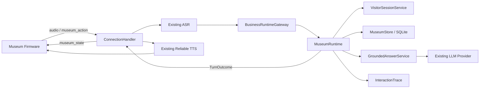

# 博物馆业务层重建实施方案

## 状态

- 计划日期：2026 年 8 月 9 日
- 产品依据：[`../product/PRD.md`](../product/PRD.md)
- 架构依据：[`../architecture/business-rebuild.md`](../architecture/business-rebuild.md)
- 现状依据：[`../architecture/current-runtime-audit.md`](../architecture/current-runtime-audit.md)
- 当前状态：阶段 A、B 已完成；阶段 C 仅保留为 2026 年 8 月 9 日的历史联调记录，必须按当前服务端和固件提交重新复验；阶段 D 至 G 待实施，旧业务清理仍在收尾

## 1. 实施目标

在不重写 ASR、LLM provider、TTS、可靠播放、WebSocket 和 OTA 的前提下，建立新的博物馆业务运行时，并完成以下最小真实链路：

```text
目标板真机
→ 等待游客说出展品
→ 首次明确展品后创建临时游客会话
→ 语音提问
→ 检索已发布事实
→ 生成有依据短回答或知识兜底
→ 真机播放
→ 屏幕显示展品、知识状态和观察任务
```

第一条链路通过前，不建设复杂后台、三条完整路线、大规模展品内容或运营仪表盘。

## 2. 目标运行结构



## 3. P0 文件布局

第一阶段控制模块数量，先建立能够独立保护业务规则的深模块：

```text
main/xiaozhi-server/core/
├── conversation_runtime.py
├── business_runtime_factory.py
├── museum/
│   ├── __init__.py
│   ├── contracts.py
│   ├── store.py
│   ├── answering.py
│   ├── runtime.py
│   └── protocol.py
├── handle/textHandler/
│   └── museumActionMessageHandler.py
└── api/
    └── museum_admin_handler.py        # P1 再启用完整能力
```

| 文件 | P0 职责 |
| --- | --- |
| `conversation_runtime.py` | 定义 `TurnRequest`、`TurnOutcome` 和运行时接口 |
| `business_runtime_factory.py` | 根据配置创建 legacy 或 museum 运行时 |
| `museum/contracts.py` | 领域枚举、请求结果和错误类型 |
| `museum/store.py` | SQLite schema、事务、内容、会话、路线和审计持久化 |
| `museum/answering.py` | 依据快照、提示编译、LLM 调用和回答守卫 |
| `museum/runtime.py` | 单一 `handle_turn()`，编排完整博物馆行为 |
| `museum/protocol.py` | 服务端与固件 JSON 的严格构造和校验 |

只有当单个文件职责明显膨胀时，才继续拆出 `catalog.py`、`journey.py` 或 `telemetry.py`，不在开工前制造空目录和空抽象。

## 4. 核心合同

### 4.1 TurnRequest

```text
request_id
transport_session_id
visitor_session_id
device_id
user_text
history
occurred_at
llm
```

`visitor_session_id` 可以为空，表示首轮尚未明确展品；服务端必须先完成显式展品解析，再创建或恢复临时游客会话。不得把 `transport_session_id` 当作游客身份。

### 4.2 TurnOutcome

```text
handled
spoken_text
knowledge_status
fact_ids
source_ids
content_version
museum_state
audit_id
error_code
```

比赛模式下，`MuseumRuntime` 对所有正常游客文本都返回 `handled=True`。资料不足通过 `knowledge_status=unsupported` 表达，不允许返回 `handled=False` 后落入通用 LLM。

### 4.3 museum_state

状态必须包含并原子应用：

- 合同版本；
- 请求 ID 和游客会话 ID；
- 当前展品及其确定来源；
- 统一回答策略；
- 路线进度；
- 当前观察任务；
- 知识状态；
- 是否允许前进、后退和结束会话。

固件收到缺字段、未知版本或非法枚举时拒绝整条状态，并保持上一个完整状态。

### 4.4 museum_action

允许的动作：

```text
select_exhibit
start_route
next_stop
previous_stop
end_session
```

每个动作必须携带唯一 `request_id`。服务端以 `(visitor_session_id, request_id)` 实现幂等，重复请求返回第一次提交结果，不重复推进路线。

## 5. 实施阶段

### 阶段 A：建立业务运行时入口（已完成）

目标：只改变调用结构，不改变现有语音和 TTS 行为。

服务端修改：

1. 新建 `conversation_runtime.py` 和 `business_runtime_factory.py`。
2. 阶段 A 期间，运行时工厂在未配置时默认使用：

   ```yaml
   business_runtime:
     type: legacy
   ```

   仓库中的 `config.yaml` 是被忽略的本地文件，不把它当作可提交配置模板。
3. 把 `ConnectionHandler.chat()` 的首个业务调用改为 `_try_business_turn()`。
4. 先用 `LegacyCompanionRuntimeAdapter` 包住现有 `_try_xiaoxin_turn()` 行为。
5. 保持普通 TTS 队列、句子 ID、ACK 和对话历史写入方式不变。

验收门槛：

- 配置为 `legacy` 时，一次现有文字对话仍能进入原运行时并产生 TTS 文本；
- 连接层开始依赖 `ConversationRuntime` 合同，不再新增 `core.xiaoxin` 业务依赖；
- 不删除任何旧业务代码。

建议聚焦测试：1 个运行时选择与回复接入测试。

### 阶段 B：单展品服务端纵向链路

状态：已于 2026 年 8 月 9 日完成。

目标：不依赖新固件页面，先通过文字输入验证博物馆业务。

服务端修改：

1. 建立 SQLite schema 和事务边界。
2. 导入一件明确标记为演示数据的展品、事实、来源和发布版本。
3. 保留设备点位资产信息，首次显式展品请求时创建临时游客会话。
4. 实现当前展品确定顺序。
5. 实现 FTS5 限定展品检索和依据快照。
6. 实现统一的 2 至 4 句儿童友好短回答。
7. 实现资料不足兜底。
8. 保存事实 ID、来源 ID、内容版本、回答和阶段延迟。
9. 设置 `business_runtime.type=museum`，比赛模式不进入旧通用聊天回退。

验收门槛：

- 一个可回答问题只使用已发布事实；
- 一个资料外问题稳定返回知识兜底；
- 审计记录能够复原本轮依据；
- 文字控制入口与真实语音入口使用同一个 `MuseumRuntime.handle_turn()`。

建议聚焦测试：已发布事实回答、资料外兜底、当前展品不明确三类行为。

### 阶段 C：首轮真机语音闭环（历史记录，待复验）

目标：一台当前目标板围绕固定展品完成真实语音提问和播报。

服务端修改：

- Hello 只建立传输连接；首次显式展品请求时创建或恢复游客会话；
- 下发初始 `museum_state`；
- 回答前下发“查阅馆方资料”状态；
- 回答完成后下发知识状态和观察任务；
- 继续使用现有 TTS 文本队列与可靠播放。

固件修改：

- Hello 声明 `museum_state_version: 1`；
- `application.cc` 增加 `museum_state` 分支；
- 新增严格的 `museum_state` 合同解析；
- 目标板首页显示当前展品、模式、知识状态和观察任务；
- 保留聆听、思考、播报、网络失败状态；
- 不改变音频、TTS ACK 或 OTA 实现。

验收门槛：

- 真机从麦克风输入到扬声器输出完整经过 ASR、检索、LLM 和 TTS；
- 屏幕能区分有依据回答、资料不足和系统失败；
- 文字接口结果不能替代真机验收结论。

以下记录来自 2026 年 8 月 9 日的历史工作区，仅用于追溯，不能作为当前版本的真机验收结论：

- 目标设备：`1c:db:d4:48:d1:50`，固件版本 `0.1.4`；
- 真人语音 ASR：`请介绍一下战国水晶杯。`；
- 审计请求：`0e4d4907344742b5859900e30b950add`；
- `grounding_status=grounded`，命中 3 条事实、2 个来源，内容版本为 1；
- 真机完成讲解播放并返回 `tts done`，`done_wait_ms=46`；
- 同一真机会话也验证了资料外问题进入 `unsupported`；
- 屏幕最终视觉效果尚需补充现场观察记录，不能仅依据串口或服务端日志声明通过。

### 阶段 D：触摸动作与原子提交

目标：让当前展品、模式和路线由明确动作改变，而不是由模型话术改变。

固件修改：

1. `Protocol` 增加公开 `SendMuseumAction()`。
2. `Application` 生成动作请求 ID并维护一个待提交动作。
3. 目标板触摸事件只发送动作并显示等待反馈。
4. 收到 `museum_action_result=committed` 和新 `museum_state` 后再更新页面。
5. `rejected`、`stale_session` 和 `temporary_failure` 保持原状态并允许重试。

服务端修改：

1. 注册 `MuseumActionMessageHandler`。
2. 严格校验版本、会话、动作和 payload。
3. 在一个 SQLite 事务中执行幂等检查、状态提交和审计写入。
4. 返回动作结果，再发送完整新状态。

验收门槛：

- 重复发送同一个 `request_id` 不会重复推进；
- 提交失败时固件不提前切换；
- 旧会话动作不能修改新会话；
- 非法 payload 不发生部分写入。

### 阶段 E：统一回答策略与连续追问

实现统一的儿童友好短讲解策略、自然语言临时调整、短期追问上下文、展品歧义确认，以及长度、问题预算和资料外具体事实守卫。守卫失败最多修复一次，再失败直接兜底。

验收门槛：回答长度和语言难度稳定、临时表达调整不改变事实 ID，连续追问不错误切换展品。

### 阶段 F：路线、回顾和设备页面替换

固件三页最终替换为展品页、路线页和回顾页。课程、待办、天气和陪伴成长 Overview 从比赛构建的数据模型与页面中移除；低电量、Wi-Fi 和 OTA 等系统告警保留为覆盖层。

服务端增加三条 3 至 5 站固定路线、路线状态机、结束参观和下一组状态清理。

验收门槛：游客能够在同一真机会话中选择模式、完成路线、结束参观，下一组看不到上一组状态。

### 阶段 G：馆方后台与内容扩充

主链路稳定后再建设展品事实与来源、审核发布、设备点位、路线配置，以及问题、依据、兜底和延迟记录。第一批先完成 6 至 8 件展品，再评估扩充到 20 至 30 件。无真实馆方授权时必须标记为演示数据。

### 阶段 H：旧业务退出与删除

只有博物馆文字链路、真机 ASR/TTS/屏幕/触摸、30 分钟连续演示、OTA 和设备遥测全部通过后，才能删除旧业务。

删除顺序：

1. 从 `app.py` 停止启动旧调度和陪伴服务；
2. 从 `ConnectionHandler` 删除身份、声纹、合规和记忆依赖；
3. 删除旧 HTTP 控制台路由；
4. 删除课程、待办、提醒和 Overview 服务端模块；
5. 删除固件旧 Overview 数据模型和页面；
6. 按真实调用关系删除剩余 `core/xiaoxin` 业务代码和旧测试。

不得先批量删除整个目录，再用编译或测试错误反推依赖。

## 6. 当前实施进度

2026 年 8 月 9 日曾完成以下源码级和历史联调工作；当前版本仍需重新验证：

1. 建立 `ConversationRuntime` 和独立 `MuseumRuntime`，比赛配置只允许 `type: museum`；
2. 导入战国水晶杯演示展品、已发布事实、两个来源和内容版本；
3. 建立设备点位、临时游客会话、事实检索、资料外兜底和交互审计；
4. 从服务端比赛运行路径删除学生身份、声纹、陪伴记忆、课程、待办、天气、提醒、门铃和旧控制台业务；
5. 固件接入严格 `museum_state` 解析，移除旧 Doorbell、Overview 和旧 ACK 消息入口；
6. 保留 OTA、WebSocket、Hello、ASR、VAD、LLM、TTS、Opus 和可靠 TTS ACK 的实现；本轮未重新执行 ESP-IDF 构建或真机复验；
7. 历史记录曾包含一台设备的唤醒、grounded、unsupported 和 TTS 播放链路，不能直接代表当前提交已通过。

当前下一步是阶段 D：把触摸动作接入 `museum_action` 和 `museum_action_result`，先完成单展品模式切换或会话结束的一条原子提交链路。阶段 E 至 G 在阶段 D 通过后再展开。

## 7. 外部输入与阻塞条件

阶段 A 和阶段 B 所需的演示展品、可核对事实、资料来源、可回答问题、资料外问题与替代测试设备标识已经具备。

阶段 C 所需的真机、设备标识、本地 WebSocket 地址和语音验收窗口曾经具备并使用过；当前提交必须重新记录服务端与固件提交号、屏幕现场观察结果和实际音频链路。

路线、后台和比赛验收开始前还需要确认第一批 6 至 8 件展品、实际展示设备数量、比赛截止日期，以及是否存在真实展馆授权资料。

这些信息缺失不会阻止建立运行时边界，但会阻止可信内容验收。
