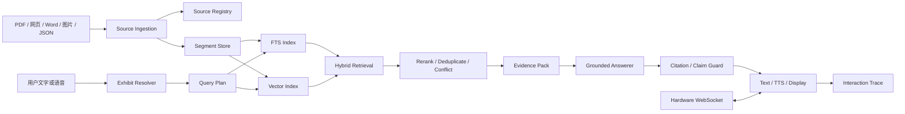

# 金潮杯博物馆 Demo：通用 RAG 与硬件对话平台计划

## 文档状态

- 状态：`in_progress`
- 目标：构建可向真实博物馆展示的通用知识 RAG 平台和语音硬件讲解终端
- 当前数据属性：公开资料、演示整理资料和测试数据，不代表任何馆方授权或馆方正式发布
- 当前内容规模：仓库现有资料标注为 101 件展品；本计划先用 15–20 件代表性展品完成纵向闭环，再扩展到 101 件
- 适用仓库：`D:\AI_Pet\jinchao-cup-museum` 与 `D:\AI_Pet\museum-firmwire`

## 当前实施状态（2026-08-15）

已完成第一件展品的服务端技术纵向切片：

- 建立来源、原文片段、声明支持/冲突关系和 `EvidencePack` 数据契约；
- 支持 PDF、Markdown/TXT、JSON、HTML 和图片 OCR sidecar 摄取；
- 摄取按 manifest 原子提交，支持幂等执行、内容版本切换和历史版本回退；
- 来源元数据按不可变版本留存，支持来源撤回、历史片段复核和同版本恢复；
- 建立 SQLite FTS、Qdrant 片段索引、RRF 混合检索和向量故障降级；
- 建立声明级 `evidence_ids`、数字/尺寸/否定校验、冲突约束和拒答路径；
- 运行时审计同时保存检索候选和实际引用，不再把整包候选冒充回答引用；
- 演示夹具包含 1 件展品、4 个异构来源和 6 个可定位片段。

当前尚未达到完整 Demo 完成定义：

- 还没有扩展到 3 件首轮验证集或 15–20 件代表性展品；
- 还没有黄金问题集、证据评测命令和指标报告；
- `evidence_segments` 仍是显式选择的后端，默认继续使用 `legacy_facts`；
- 来源撤回尚未自动触发 Qdrant 重建；当前先实时过滤撤回来源，再由下一次显式重建清理向量副本；
- 尚未修改固件协议，也没有完成真机 ASR/RAG/TTS 验收。

## 1. 产品定位

本项目不是为当前某一家博物馆定制的后台，也不是把已有人工事实条目包装成聊天机器人。目标是做一套可以迁移到不同博物馆的参考实现：

```text
异构资料摄取
    → 来源与版本管理
    → 可定位原文片段
    → 混合检索与重排序
    → 证据包与引用
    → 受约束回答
    → 语音硬件交互
```

未来馆方接入时，主要替换知识来源、内容审核流程和展厅配置，不重写 RAG 内核、对话运行时和设备协议。

### 1.1 Demo 必须证明的能力

1. 能摄取 PDF、网页、Word、结构化数据和图片 OCR 等不同来源。
2. 能从自然表达中识别展品或发现歧义，并在必要时要求澄清。
3. 能使用关键词检索和向量检索共同召回证据。
4. 能把回答追溯到具体来源、页码、段落或图片区域。
5. 能识别证据不足和来源冲突，不用模型常识补写答案。
6. 能在连续语音对话中保持当前展品和追问上下文。
7. 能将回答状态、证据状态和失败原因同步到硬件。
8. 能通过固定评测集和真机记录证明上述能力，而不是只展示一次成功问答。

### 1.2 明确非目标

- 第一阶段不建设馆方 CMS、权限后台或商业化运营系统。
- 不假设当前存在真实馆方审核、授权或生产数据。
- 不把人工编写的演示摘要伪装成原始文献。
- 不为了数量先批量制作 101 份同质 PDF。
- 不将实时设备状态、路线状态等业务数据库问题强行交给向量检索。

## 2. 现有代码的处理原则

当前仓库已有事实条目、SQLite FTS、Qdrant、RRF 融合、证据快照、回答守卫和交互审计。这些能力保留，作为高可信声明层和运行时基础。

需要改变的是定位和上游数据模型：

| 当前形态 | 目标形态 |
| --- | --- |
| `exhibit_fact.statement` 是主要检索对象 | 原始资料片段和审核事实并行检索 |
| `source_id` 只能作为关联 ID | 来源、定位、原文摘录和版本可直接回溯 |
| 先锁定 `exhibit_id` 再检索 | 展品解析与知识检索分成两个阶段 |
| LLM 选择事实 ID | LLM 输出带证据 ID 的声明，服务端校验引用 |
| “馆方已发布”措辞 | “演示知识库已发布”并标记真实来源等级 |
| 主要依赖字符覆盖率守卫 | 引用校验、数字/实体校验、冲突检测和必要的模型复核 |

现有 `docs/roadmap/2026-08-rag-scale-up-plan.md` 面向生产馆藏扩容，不直接作为本 Demo 的内容目标；其中的索引、发布、备份和评测经验可以复用，但“真实馆方内容”和“生产发布”结论必须在未来获得真实对接后重新确认。

## 3. 目标架构



### 3.1 核心知识关系

```text
source_document
    └── source_segment
            └── knowledge_claim
                    └── exhibit
```

实际关系允许多对多：一本图录可以支持多件展品，一条事实也可以由多份来源共同支持。

### 3.2 可信等级

```text
primary_public_source   公开的一手或正式出版来源
secondary_public_source 公开研究、目录或可靠二手资料
demo_curated             为演示整理并人工复核的声明
synthetic_demo           专门用于边界测试的合成内容
unverified               尚未完成核实的内容
```

回答策略必须读取可信等级。`synthetic_demo` 和 `unverified` 不得在默认观众模式中被当作确定事实。

## 4. 阶段总览

| 阶段 | 目标 | 主要交付物 | 退出条件 |
| --- | --- | --- | --- |
| 0 | 锁定 Demo 边界 | 产品定位、术语、来源等级、验收矩阵 | 不再出现未经证实的馆方/生产表述 |
| 1 | 建立知识数据契约 | 来源、片段、声明、引用和版本模型 | 一份来源可完整追溯到片段和声明 |
| 2 | 15–20 件纵向语料 | 异构资料包、黄金问题集、索引清单 | 文档摄取和增量重建可重复 |
| 3 | 真正的 RAG 内核 | 混合召回、重排序、证据包、冲突处理 | 检索指标和引用指标达到门槛 |
| 4 | 受约束回答 | 声明级引用、拒答、回答守卫 | 无证据问题不会被模型补写 |
| 5 | 硬件语音闭环 | 流式 ASR/RAG/TTS、状态协议、打断重试 | 真机完成至少一条完整用户路径 |
| 6 | 评测与演示发布 | 自动评测、验收报告、演示脚本 | 文本和真机证据可复核 |
| 7 | 扩展到 101 件 | 批量内容、索引版本、试点材料 | 规模扩展不改变核心接口 |

## 5. 阶段 0：定位与合同冻结

### 目标

清除“馆方已经审核”“真实生产馆藏”等不符合当前事实的表述，冻结 Demo 的输入、输出和可信等级。

### 任务

1. 更新 README、RAG 设计文档和回答提示词中的产品措辞。
2. 明确 `demo_curated`、`public_source`、`synthetic_demo`、`unverified` 的语义。
3. 定义三类用户路径：观众问答、管理员查看证据、硬件语音交互。
4. 定义每类路径允许展示的来源信息和拒答方式。
5. 形成固定验收矩阵：检索、引用、拒答、歧义、多轮、硬件。

### 退出条件

- 文档和代码不再声称当前已有馆方对接。
- 所有知识条目都有来源等级。
- 每个后续阶段都有可观察的完成标准。

## 6. 阶段 1：知识数据契约

### 目标

让系统能保存“原始来源 → 原文片段 → 审核声明 → 展品”的完整链路。

### 建议实体

```text
knowledge_source
source_segment
knowledge_claim
claim_support
exhibit_source_link
ingestion_run
index_build
```

### 最小字段

来源必须记录：标题、类型、原始路径或 URL、发布时间、采集时间、SHA-256、授权状态、来源等级和版本。

片段必须记录：片段 ID、来源 ID、文本、页码/章节/坐标、解析器版本、OCR 置信度和关联展品。

声明必须记录：声明 ID、展品 ID、事实类型、文本、确定性、发布状态、支持片段和冲突片段。

### 退出条件

- 可以从任意回答事实反查原文片段。
- 可以从任意原文片段反查其来源和关联展品。
- 内容更新会生成新版本，不覆盖旧版本。
- 数据库和向量索引都能使用同一组稳定 ID。

## 7. 阶段 2：15–20 件代表性展品纵向切片

### 目标

先验证架构，不先追求 101 件数量。

### 语料组成

首批资料要故意保持异构：

- 正常文本 PDF
- 扫描 PDF 或展签图片
- HTML 页面快照
- Markdown/JSON 结构化记录
- 一份包含多件展品的图录或目录
- 一组资料不足或存在冲突的展品

每件展品准备 2–4 个来源、5–15 个可引用片段和 5–8 个标准问题；所有演示加工内容标记为 `demo_curated`。

### 退出条件

- 资料可以在隔离数据目录中重建。
- 重复执行摄取不会生成重复片段。
- 单份来源可以被多件展品引用。
- 删除或撤回来源后，旧索引不会继续被回答使用。

## 8. 阶段 3：RAG 内核

### 目标

把当前“事实条目 Hybrid 检索”扩展为“片段 + 声明双层检索”。

### 检索流程

1. 解析展品实体：唯一、歧义、缺失、未收录。
2. 生成查询计划：原始问题、改写问题、元数据过滤。
3. 片段层执行 FTS 和向量召回。
4. 声明层执行结构化事实召回。
5. 对两路候选执行 RRF 或加权融合。
6. 对候选做重排序、去重和来源多样性控制。
7. 检测来源冲突、版本冲突和可信等级差异。
8. 输出有边界的 `EvidencePack`，而不是裸事实列表。

### 退出条件

- 检索器不依赖 LLM 才能完成基本召回。
- 查询改写失败时仍可使用原始查询。
- Qdrant 故障时有可观察的 FTS 降级路径。
- 每个候选都能解释“为什么被召回”。

## 9. 阶段 4：证据约束回答

### 目标

让模型生成可审计的答案，而不是只返回一个自由文本。

### 输出契约

```json
{
  "status": "grounded | partial | conflicting | unsupported",
  "answer": "……",
  "claims": [
    {
      "text": "……",
      "evidence_ids": ["segment-0001", "claim-0002"]
    }
  ],
  "follow_up": ""
}
```

服务端必须校验：

- 引用的证据确实在本轮 EvidencePack 中；
- 数字、年代、尺寸和专有名词来自证据；
- `unsupported` 不得携带事实性答案；
- `conflicting` 必须展示冲突而不能擅自选边；
- 观众语音答案可以隐藏技术引用，但审计记录必须保留引用。

### 退出条件

- 无证据问题的拒答率达到预设门槛。
- 事实性回答可以逐条回溯到片段。
- 模型失败、超时或返回非法结构时有确定性回退。

## 10. 阶段 5：硬件语音闭环

### 目标

在不把硬件逻辑塞进 RAG 模块的前提下，完成真实语音用户路径。

### 服务端职责

- 流式 ASR 编排
- 展品解析和会话状态
- RAG 检索与证据校验
- 流式 TTS
- 状态、错误和审计事件

### 固件职责

- 唤醒、VAD、录音和播放
- 状态显示
- 播放打断和重试
- WebSocket 重连
- 设备能力和版本上报

### 必验用户路径

1. 唤醒设备并提出第一轮展品问题。
2. 服务端解析展品、检索证据并播报答案。
3. 用户使用“它”“这件展品”进行追问。
4. 用户提出无依据问题，设备播报明确的资料不足回答。
5. 用户打断播放并重新提问。
6. 网络短暂失败后恢复并保留可解释状态。

### 退出条件

- 真机记录设备标识、固件 SHA、服务端 SHA、时间、步骤和异常日志。
- 文本验收和语音验收分开记录，不用文本结果代替真机结果。
- 服务端与固件协议字段在两仓库中一致。

## 11. 阶段 6：评测与演示门禁

### 自动评测指标

以下是建议目标，不是当前已达成的结果：

| 指标 | 建议目标 |
| --- | --- |
| Gold evidence Recall@5 | ≥ 0.85 |
| 引用正确率 | ≥ 0.95 |
| 无依据问题拒答率 | ≥ 0.90 |
| 展品唯一解析准确率 | ≥ 0.95 |
| 歧义问题澄清率 | ≥ 0.90 |
| 审计可复现率 | 100% |
| 文本链路 P95 | 单独记录模型外部延迟和总延迟 |

### 评测集分类

- 直接事实问题
- 自然改写问题
- 多轮追问
- 展品别名和 ASR 变体
- 相似展品干扰
- 来源冲突
- 无资料问题
- 价格等明确不支持问题
- 提示注入和越权问题
- 设备中断、重连和重复请求

### 演示材料

- 一张架构图
- 一段文档摄取和索引构建记录
- 一组带引用的答案审计截图
- 一段拒答和冲突处理演示
- 一段真机语音视频或逐步验收记录
- 一页指标和已知限制

## 12. 阶段 7：扩展到 101 件

只有阶段 3–6 的接口和评测门槛稳定后，才扩展内容数量。

扩展时按批次执行：

```text
批次 A：15–20 件架构验证集
批次 B：约 30 件资料类型扩展集
批次 C：约 50 件规模压力集
批次 D：补齐到 101 件演示集
```

每批次都生成独立的：

- 来源清单
- 内容版本
- 索引版本
- 评测结果
- 未覆盖问题清单
- 回滚记录

## 13. 首个可执行迭代

第一轮只做一个完整纵向切片，不同时追求大规模内容和复杂后台：

1. 定义 `knowledge_source`、`source_segment`、`knowledge_claim` 的最小模型。
2. 选 3 件展品，准备 PDF、图片或结构化资料三种输入。
3. 实现可重复的文档解析、分段、哈希和清单生成。
4. 将片段写入 SQLite FTS 和 Qdrant。
5. 输出带 `evidence_ids` 的 EvidencePack。
6. 改造回答提示词和服务端引用校验。
7. 为 3 件展品建立至少 20 个自动评测问题。
8. 用现有硬件协议跑通一条文字到语音的真实路径。

首轮通过后，再扩展到 15–20 件；首轮不通过时，不增加展品数量。

## 14. 主要风险与控制

| 风险 | 控制措施 |
| --- | --- |
| 演示资料被误认为馆方事实 | 强制来源等级和产品文案分离 |
| 统一制作 PDF 造成伪原始资料 | 保留原始格式，PDF 仅作为一种输入适配器 |
| 过早扩展到 101 件 | 先通过代表性纵向切片和评测门禁 |
| 只优化人工事实检索 | 同时建立原文片段层和声明层 |
| 模型答案流畅但无法引用 | 声明级证据 ID 和服务端校验 |
| Qdrant 或模型不可用 | FTS 降级、确定性答案和可观察错误状态 |
| 固件协议与服务端漂移 | 每次联调同时核对两个仓库和提交 SHA |
| 只做文本演示 | 把真机路径列为独立阶段和独立验收证据 |

## 15. 计划完成定义

本计划不以“有 101 件资料”作为完成标准。达到以下条件，才可以称为可对外展示的 Demo：

1. 至少 15–20 件展品经过异构资料摄取和可追溯索引。
2. 回答能够引用来源片段，且无依据问题会拒答。
3. 自动评测集覆盖召回、引用、拒答、歧义和多轮场景。
4. 真机完成一条从语音输入到语音输出的闭环。
5. 所有演示资料明确标记为公开资料或演示整理资料。
6. 扩展到 101 件时不需要改变 RAG 和硬件对话核心接口。

## 16. 具体实施步骤

本节是实际开工顺序。每个步骤都指定代码位置、产物、验证命令和停止条件。没有通过前一步的退出条件，不进入下一步。

### Step 0：建立隔离分支和可重复基线

**目的**：确保新 RAG 数据层不会破坏当前事实条目链路和设备协议。

**操作**：

1. 在服务端仓库确认当前分支、远端和工作区状态：

   ```powershell
   cd D:\AI_Pet\jinchao-cup-museum
   git status --short --branch
   git remote -v
   git log -1 --oneline
   ```

2. 在固件仓库执行同样的三项检查，不修改两个仓库已有的未提交文件。
3. 建立实现分支，例如 `codex/demo-rag-evidence-platform`。
4. 固定一个当前基线命令集：

   ```powershell
   cd D:\AI_Pet\jinchao-cup-museum\main\xiaozhi-server
   & D:\AI_Pet\jinchao-cup-museum\.venv\Scripts\python.exe -m pytest tests/test_museum_hybrid_retrieval.py tests/test_museum_llm_contract.py tests/test_museum_runtime.py
   ```

**产物**：`docs/roadmap/baseline-demo-rag-<sha>.md`，记录服务端 SHA、固件 SHA、测试结果和已知失败。

**退出条件**：基线测试结果可重复；新分支没有覆盖用户已有修改；服务端和固件的协议版本均记录。

### Step 1：冻结来源和证据数据契约

**修改文件**：

- `main/xiaozhi-server/core/museum/contracts.py`
- `main/xiaozhi-server/core/museum/store.py`
- `main/xiaozhi-server/core/museum/content_import.py`
- 新增 `main/xiaozhi-server/core/museum/evidence_store.py`（只放证据层访问接口）

**新增类型**：

```python
SourceDocument(
    id, title, source_type, locator, checksum, source_level,
    rights_status, collected_at, parser_version, metadata
)

SourceSegment(
    id, source_id, text, locator, exhibit_ids,
    section, page, ocr_confidence, content_hash
)

KnowledgeClaim(
    id, exhibit_id, fact_type, statement, certainty,
    status, supporting_segment_ids, conflicting_segment_ids
)

EvidenceItem(
    id, kind, text, source_id, segment_id, locator,
    score, rank, source_level, content_version
)

EvidencePack(
    query_id, exhibit_ids, items, claims, index_version,
    retrieval_trace, conflict_groups
)
```

**SQLite 表**：

```sql
knowledge_source
source_segment
source_segment_exhibit
knowledge_claim_support
knowledge_claim_conflict
ingestion_run
index_build
source_segment_fts
```

所有表必须具备稳定主键、创建时间、内容哈希和版本字段。原始二进制文件不写进 SQLite，只保存相对路径或受控 URI。

**实现要求**：

1. 新表通过现有 `MuseumStore` 初始化流程创建，不能依赖手工执行 SQL。
2. 旧的 `exhibit_fact`、`fact_source` 和已有发布流程继续工作。
3. 新旧事实通过 `knowledge_claim_support` 关联，不能复制出两套无法对账的事实。
4. 删除或撤回来源时采用状态变更和新索引版本，不物理删除仍被历史审计引用的记录。

**自动化验证**：新增 `tests/test_museum_evidence_store.py`，只覆盖：

- 来源、片段、声明的增删改查；
- 多件展品共享一个来源；
- 版本切换不读取旧版本；
- 历史交互仍能复核旧证据。

**退出条件**：可以用一个内存 SQLite 建立一份来源、两个片段、一条声明和一个冲突关系，并从声明反查原文片段。

### Step 2：实现来源清单和文档摄取器

**新增文件**：

- `main/xiaozhi-server/core/museum/source_ingestion.py`
- `main/xiaozhi-server/core/museum/source_parsers.py`
- `main/xiaozhi-server/scripts/ingest_museum_sources.py`
- `main/xiaozhi-server/scripts/validate_source_manifest.py`
- `main/xiaozhi-server/tests/test_museum_source_ingestion.py`

**目录约定**：

```text
main/xiaozhi-server/content/museum-demo/
├── manifest.yaml
├── originals/
├── extracted/
├── claims/
└── eval/
```

`originals/` 不进入容器镜像；开发环境可以放在仓库外的数据目录，Git 只跟踪脱敏的 manifest、声明和小型测试夹具。

**第一版适配器**：

1. `JsonParser`：读取结构化演示资料。
2. `MarkdownParser`：保留标题层级和段落。
3. `PdfTextParser`：读取有文本层的 PDF，并保留页码。
4. `HtmlParser`：提取正文和标题，保留 URL。
5. `SidecarOcrParser`：扫描 PDF/图片先读取同名 `.ocr.json`，不在第一轮强行引入不稳定的本地 OCR 运行时。

后续再把 OCR 引擎接到同一个 `SourceParser` 接口，不改变下游数据模型。

**manifest 最小格式**：

```yaml
schema_version: 1
dataset_id: museum-demo-pilot-001
sources:
  - id: src-crystal-cup-catalog
    title: 演示图录摘录
    source_type: pdf
    path: originals/crystal-cup-catalog.pdf
    source_level: secondary_public_source
    rights_status: demo_authorized
    exhibit_ids: [warring-states-crystal-cup]
```

**摄取步骤**：

1. 校验 manifest 字段和路径是否在允许的数据目录内。
2. 计算原始文件 SHA-256。
3. 根据扩展名选择解析器。
4. 规范化 Unicode、空白、页码和标题层级。
5. 用 `source_id + page/section + ordinal + content_hash` 生成稳定 `segment_id`。
6. 写入 `source_segment` 和 FTS5，不立即切换线上索引。
7. 输出 `ingestion_run.json`，记录成功、跳过和失败原因。

**命令**：

```powershell
cd D:\AI_Pet\jinchao-cup-museum\main\xiaozhi-server
python scripts/validate_source_manifest.py --manifest content/museum-demo/manifest.yaml
python scripts/ingest_museum_sources.py --manifest content/museum-demo/manifest.yaml --database data/museum-demo.db --run-id pilot-001
```

**退出条件**：同一 manifest 重复摄取不会产生重复片段；任一片段可以定位到文件和页码/段落；解析失败不会部分发布。

### Step 3：用 3 件展品构建第一批真实夹具

**目的**：先验证数据模型和摄取器，不等待 101 件资料完成。

**选择规则**：

- 一件有文本 PDF；
- 一件有图片或扫描资料；
- 一件有多个来源且至少存在一个不确定结论；
- 至少两件展品名称或别名容易混淆。

**每件展品需准备**：

- 一个展品记录；
- 至少两个来源；
- 至少五个原文片段；
- 至少三条声明；
- 一个应拒答问题；
- 一个多轮追问；
- 一个歧义名称问题。

**新增夹具**：

```text
tests/fixtures/museum_sources/pilot/
├── manifest.yaml
├── originals/
├── extracted/
├── claims.yaml
└── evaluation.json
```

夹具中可以使用公开资料的短摘录和明确标记的演示资料，不得把未经核实的内容写成馆方事实。

**退出条件**：三件展品可在无外网环境中完成解析、入库、检索和确定性回答。

### Step 4：建立通用片段向量索引

**修改/新增文件**：

- 新增 `main/xiaozhi-server/core/museum/evidence_index.py`
- 保留 `core/museum/qdrant_index.py` 作为现有事实索引适配器
- 新增 `main/xiaozhi-server/scripts/build_museum_evidence_index.py`
- 新增 `tests/test_museum_evidence_index.py`

不要直接把 `QdrantFactIndex` 的 `fact_id` 改成 `segment_id`，以免破坏现有发布和回滚测试。新增 `QdrantEvidenceIndex`，接口固定为：

```python
search(query_vector, *, exhibit_ids=(), source_ids=(), limit=...) -> tuple[DenseEvidenceHit, ...]
rebuild(records, vectors) -> IndexBuildResult
count() -> int
validate(version) -> IndexValidationResult
```

**payload 最小字段**：

```text
segment_id
source_id
exhibit_ids
source_level
content_version
parser_version
locator
text_hash
```

**构建流程**：

1. 从 `source_segment` 读取当前可发布片段。
2. 按批次调用现有 `TextEmbedder.embed_many()`。
3. 验证向量数量、维度和文本哈希一一对应。
4. 创建带版本的 build collection。
5. 精确核对点数和 payload。
6. 通过 alias 原子切换。
7. 成功切换时登记唯一的已发布版本 alias，只清理已完成的旧发布版本，避免误删尚未发布的并发 build。
8. 保留当前版和上一版 collection；失败时删除新 build，不改变当前 alias。

**命令**：

```powershell
python scripts/build_museum_evidence_index.py `
  --database data/museum-demo.db `
  --collection museum-evidence-demo `
  --embedding-model text-embedding-v4 `
  --run-id pilot-001
```

**退出条件**：索引点数等于可发布片段数；任意点都能反查 SQLite 片段；模拟 Qdrant 失败不会破坏旧 alias。

### Step 5：实现片段与事实的混合检索

**修改文件**：

- `main/xiaozhi-server/core/museum/retrieval.py`
- `main/xiaozhi-server/core/museum/query_understanding.py`
- `main/xiaozhi-server/core/museum/evidence_store.py`
- 新增 `main/xiaozhi-server/core/museum/reranking.py`

**新增接口**：

```python
class EvidenceSearchRequest:
    question: str
    exhibit_ids: tuple[str, ...] = ()
    source_ids: tuple[str, ...] = ()
    fact_types: tuple[str, ...] = ()
    limit: int = 8

class EvidenceSearchService:
    def search(self, request: EvidenceSearchRequest) -> EvidencePack: ...
```

**检索顺序**：

1. `ExhibitResolver` 返回唯一、歧义、缺失或未收录状态。
2. 对问题生成原始查询和有限的规则改写，不让模型决定过滤边界。
3. SQLite FTS 召回片段。
4. Qdrant 召回片段。
5. 保留现有事实层召回作为高可信候选。
6. 使用 RRF 融合，加入来源等级、版本和展品匹配过滤。
7. 进行确定性的去重和多来源多样性控制。
8. 对候选声明和片段形成 `EvidencePack`。

第一轮不接入 LLM reranker，先建立可解释基线；只有基线指标不足时再增加可替换 reranker adapter。

**自动化验证**：扩展 `tests/test_museum_hybrid_retrieval.py`，新增片段召回、跨来源去重、冲突保留、Qdrant 降级和无展品过滤测试。

**退出条件**：检索结果包含 `segment_id`、来源定位、召回阶段和分数；同一问题可解释为什么选中或拒绝每个候选。

### Step 6：重构证据包和回答契约

**修改文件**：

- `main/xiaozhi-server/core/museum/llm_contract.py`
- `main/xiaozhi-server/core/museum/answering.py`
- `main/xiaozhi-server/core/museum/contracts.py`
- `main/xiaozhi-server/tests/test_museum_llm_contract.py`
- `main/xiaozhi-server/tests/test_answer_guard.py`

**迁移策略**：

1. 保留旧的 `fact_ids` JSON 解析路径一轮版本，避免当前文本链路立即中断。
2. 新增 `evidence_ids` 和 `claims` 字段。
3. 运行时优先使用新契约；旧契约只作为兼容回退并记录 `legacy_grounding_contract`。
4. 服务端验证所有 evidence ID 属于本轮 `EvidencePack`。
5. 对每个 claim 校验数字、年代、尺寸、专有名词和否定词。
6. 无法验证的 claim 整体拒绝，不用部分字符串覆盖率放行。
7. 失败时使用确定性证据摘要或明确 `unsupported`。

**提示词输入格式**：

```text
[EVIDENCE evidence-001]
来源：...
定位：第 3 页 / 第二节
原文：...
可信等级：...
[/EVIDENCE]
```

**退出条件**：模型回答中的每条事实性声明都有证据 ID；非法 JSON、越权 ID、无证据数字和冲突擅自选边都会被服务端拒绝。

### Step 7：接入现有 MuseumRuntime，不重写音频协议

**服务端修改范围**：

- `main/xiaozhi-server/core/museum/runtime.py`
- `main/xiaozhi-server/core/museum/answering.py`
- `docs/protocol/server-firmware-contract.md`
- `docs/requirements/ac-010-4-firmware-verification.md`

**实现顺序**：

1. `MuseumRuntime.handle_turn()` 先完成展品解析，再构建 `EvidenceSearchRequest`。
2. 检索开始时发送现有 `grounding.status = retrieving`。
3. 形成 EvidencePack 后写入交互审计。
4. 回答成功发送 `grounded`、来源数量和内容版本。
5. 无依据发送 `unsupported`，与模型/网络失败分开。
6. 所有状态变更继续沿用 `/museum/v1/` 和现有 `museum_state`，不新增旧项目字段。

**退出条件**：文字输入可以同时返回答案、证据 ID、来源 ID、检索 trace 和设备状态；旧的事实检索测试仍然通过。

### Step 8：固件状态和真机链路

**固件仓库重点文件**：

- `D:\AI_Pet\museum-firmwire\main\museum_state.h`
- `D:\AI_Pet\museum-firmwire\main\protocols\protocol.h`
- `D:\AI_Pet\museum-firmwire\main\protocols\websocket_protocol.h`
- 目标板显示实现和 `tests/` 中的协议测试

**原则**：不把 EvidencePack 或原始来源全文发送到设备。设备只接收：

```text
grounding.status
source_count
content_version
exhibit_id / exhibit_name
prompt_title / prompt_body
```

**真机实施顺序**：

1. 先用固定 JSON 驱动 `museum_state` 解析和显示测试。
2. 再验证服务端下发 `retrieving → grounded` 状态序列。
3. 再验证 `unsupported` 和 `temporary_failure` 的显示差异。
4. 接入麦克风、ASR、RAG、TTS 的完整路径。
5. 验证 TTS ACK、播放打断、重连和重复 request_id。
6. 记录目标设备、固件 SHA、服务端 SHA、时间、ASR 文本、审计 ID、屏幕和扬声器结果。

**退出条件**：真机完成一次有依据回答、一次资料不足回答、一次追问和一次打断；不能用文本脚本结果替代其中任何一项。

### Step 9：建立评测与发布命令

**修改/新增文件**：

- `main/xiaozhi-server/core/museum/evaluation.py`
- `main/xiaozhi-server/tests/fixtures/museum_sources/pilot/evaluation.json`
- 新增 `main/xiaozhi-server/scripts/run_museum_evidence_eval.py`
- 新增 `main/xiaozhi-server/scripts/export_museum_demo_report.py`

**评测输出必须包含**：

- question ID
- 预期展品 ID
- 预期 evidence/claim ID
- 实际召回排名
- 实际引用 ID
- 状态是否正确
- 延迟分段
- 失败原因

**命令**：

```powershell
python scripts/run_museum_evidence_eval.py `
  --fixture tests/fixtures/museum_sources/pilot/evaluation.json `
  --database data/museum-demo.db `
  --run-id pilot-eval-001 `
  --json-output data/evals/pilot-eval-001.json
```

**阶段门槛**：

- Gold evidence Recall@5 ≥ 0.85；
- 引用正确率 ≥ 0.95；
- 无依据问题拒答率 ≥ 0.90；
- 歧义问题澄清率 ≥ 0.90；
- 审计记录可重放率 100%。

这些是进入下一阶段的建议门槛，不是对当前系统能力的描述。

### Step 10：扩展到 15–20 件，再扩展到 101 件

**批次脚本**：

```powershell
python scripts/validate_source_manifest.py --manifest content/museum-demo/batch-02.yaml
python scripts/ingest_museum_sources.py --manifest content/museum-demo/batch-02.yaml --run-id batch-02
python scripts/build_museum_evidence_index.py --run-id batch-02
python scripts/run_museum_evidence_eval.py --fixture content/museum-demo/eval/batch-02.json --run-id batch-02-eval
```

每一批次必须生成：

- manifest 快照；
- ingestion run；
- SQLite 内容版本；
- Qdrant build collection 和 alias 记录；
- 评测 JSON；
- 未命中和冲突清单；
- 可回滚的上一版索引和数据库备份。

只有 15–20 件纵向切片通过后，才允许补齐到 101 件。扩容不改变 `EvidenceSearchService`、`EvidencePack` 和硬件 `museum_state` 接口。

## 17. 首轮代码变更清单

首轮不应同时修改所有模块。建议按以下提交顺序拆分，每个提交都能单独验证：

| 提交 | 内容 | 主要文件 | 验证 |
| --- | --- | --- | --- |
| 1 | 证据数据类型和 SQLite 表 | `contracts.py`, `store.py`, `evidence_store.py` | `test_museum_evidence_store.py` |
| 2 | 来源 manifest 和解析器 | `source_ingestion.py`, `source_parsers.py` | `test_museum_source_ingestion.py` |
| 3 | 3 件展品离线夹具 | `content/museum-demo`, `tests/fixtures` | manifest 校验和重复摄取 |
| 4 | 片段 FTS 检索 | `store.py`, `evidence_store.py` | FTS 召回测试 |
| 5 | 片段 Qdrant 索引 | `evidence_index.py`, build script | 隔离索引测试 |
| 6 | EvidencePack 和混合检索 | `retrieval.py`, `reranking.py` | 混合检索测试 |
| 7 | 新回答契约和引用守卫 | `llm_contract.py`, `answering.py` | LLM contract/guard 测试 |
| 8 | Runtime 状态接入 | `runtime.py` | runtime 回归测试 |
| 9 | 固件状态回归 | 固件协议和显示文件 | 固件构建与协议测试 |
| 10 | 评测、报告和演示脚本 | `evaluation.py`, `scripts/` | pilot eval 和报告 |

## 18. 每一步的停止规则

- 数据契约失败：停止，不继续写解析器。
- 解析片段不能稳定定位：停止，不建立向量索引。
- Recall 达不到门槛：停止，不接入 LLM 生成优化。
- 引用校验失败：停止，不接真机语音。
- 文字链路未通过：停止，不宣称硬件 RAG 完成。
- 固件协议不一致：停止，不刷写生产或演示设备。

这样做的目的不是增加流程，而是避免出现“模型能说话，但无法证明它为什么这么说”的伪 RAG Demo。
